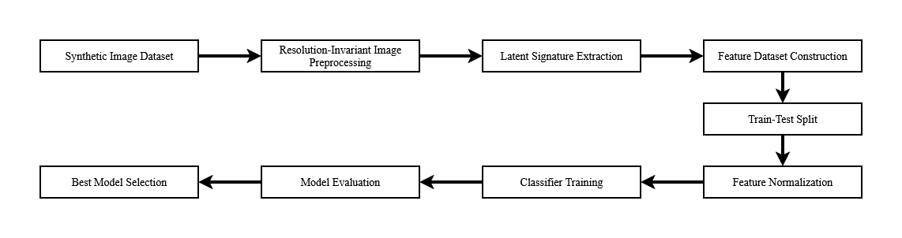
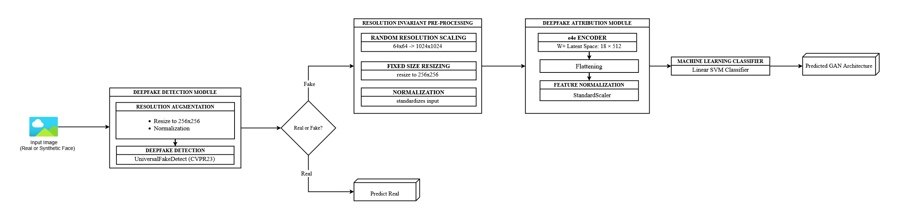
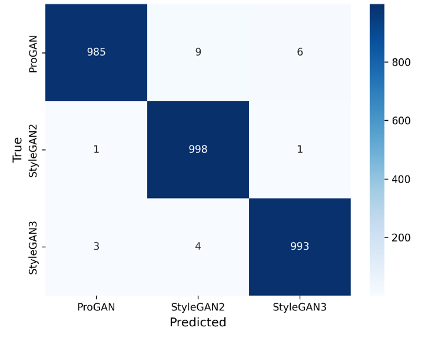

# GANOrigin: Deepfake Detection & GAN Attribution for Faces using Latent Space

This is a AI/ML project that aims to detect and attribute GAN generated images for faces. It is a two stage pipeline that first detects whether an image of a face is fake or not. If the image is found to be fake, it will attribute to which among the GAN models generated it. Our current implementation is able to attribute images to [StyleGAN2](https://github.com/NVlabs/stylegan2.git), [StyleGAN3](https://github.com/NVlabs/stylegan3.git) and [ProGAN](https://github.com/imprasukjain/PROGAN.git).

## Modules

Our proposed model in it's current stage is implemented using two modules; 1) Deepfake Detection Module 2) Deepfake Attribution Module. 

1. <strong>Deepfake Detection Module:</strong>  
This module is responsible for detecting whether the inputted image is deepfake or not. Our main body of work is not focused on this module. So we have just implemented a pretrained model, [UniversalFakeDetect](https://github.com/WisconsinAIVision/UniversalFakeDetect.git) which is pretty good for detecting deepfakes especially those generated by models from GAN family.  

2. <strong>Deepfake Attribution Module: </strong>  
This module is responsible for attributing the image to the GAN model that generated the image. This is our main body of work. How this module works is that once a deepfake image of a face is detected by the deepfake detection module, it will be fed into this module. This module will pass it through [e4eEncoder](https://github.com/omertov/encoder4editing.git), which will project the image to latent space which will give us latent features. The latent features are then fed into a Linear SVM model that predicts which GAN model generated that particular deepfake.

## Model Training

The model training that was mainly done was for the Linear SVM. The Linear SVM was trained of latent features that were obtained from 5000 images of each class among StylGAN2, StyleGAN3 and ProGAN. Each of those images were projected into W+ latent space. The latent features were then used to train the Linear SVM model after subjecting to Resolution Augmentation as to avoid model convergence due to resolution artifactation.

## Methodology
It uses latent space to achieve this.

<ul>
<li>Image --(CLIP ViT-L/14)--> Deepfake Detection --(if real)--> Output real</li>  
<li>Image --(CLIP ViT-L/14)--> Deepfake Detection --(if fake)--> Deepfake Image Detected --(e4e Encoder)--> latent features --(Linear SVM)--> Predicted Architecture</li>
</ul>

  



## Tech Stack

Frontend: React (TypeScript + Tailwind)  
Backend: Flask  
ML/DL: PyTorch, Scikit-learn  
Models: UniversalFakeDetect (CLIP-based), e4e Encoder, Linear SVM

## Results

We obtained a Linear SVM  that demonstrated an accuracy of 99%. 



Below given is the classification report for the model:

|             | precision  | recall   | f1-score  |  support  |  
|-------------|------------|----------|-----------|-----------|
| progan      | 1.00       | 0.98     | 0.99      | 1000      |
| stylegan2   | 0.99       | 1.00     | 0.99      | 1000      |
| stylegan3   | 0.99       | 0.99     | 0.99      | 1000      |
|-------------|------------|----------|-----------|-----------|
| accuracy    |            |          | 0.99      | 3000      |
| macro avg   | 0.99       | 0.99     | 0.99      | 3000      |
| weighted avg| 0.99       | 0.99     | 0.99      | 3000      |

## Setup

1. Clone Repo  
```
git clone https://github.com/HamiYasir/Deepfake-Detection-GAN-Attribution-for-Faces-using-Latent-Space.git   
cd Deepfake-Detection-GAN-Attribution-for-Faces-using-Latent-Space
```
2. Backend Setup  
```
cd backend
python -m venv venv  
venv\Scripts\activate   # Windows  
pip install -r requirements.txt  
Run: python app.py  
```

3. Frontend Setup
```
cd frontend
npm install
npm run dev
```

## API Endpoint

`POST /predict`

Input: Image file
Output:

{  
  "prediction": "StyleGAN2",  
  "confidence": 0.94,  
  "probabilities": {...},  
  "deepfake_score": 0.97  
}

## Future Works

- Can extend the scope from just images of faces to objects/people.
- Can extend the scope from just image inputs to video, audio, etc...
- Current implementation only works on GAN models. It would be amazing to figure out a way to include Diffusion models and especially account for images generated by ChatGPT, NanoBanana Pro, etc.
- I saw a cool site for [Deepfake Detection](https://deepfakedetection.io/). Although it only does deepfake detection, it does this cool explainability where it analyzes each part of the detected image and tells what feature's were detected that contributed that image to being a deepfake or not. While judging by my limited knowledge, I think that explainabilityh is achieved by pixel artefact detction and considereing the fact that we are not doing that, it would still be pretty cool to see that explainability in here.

## Deployment

Ths has yet to be deployed :)